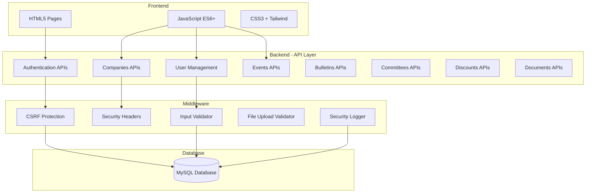
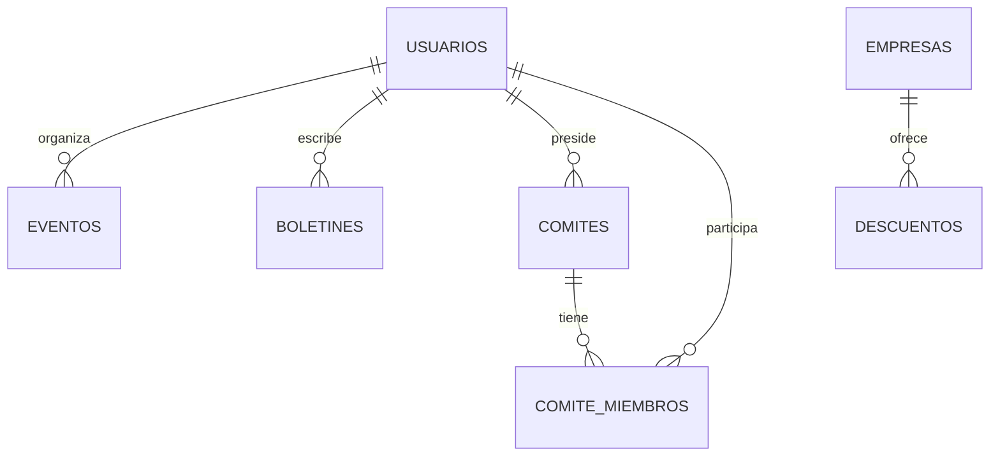
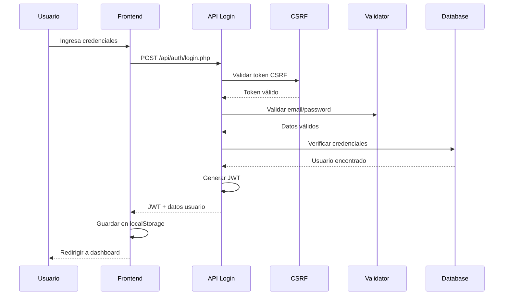
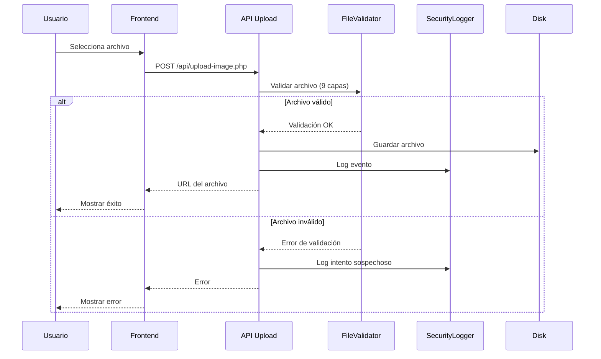

# 🏗️ Arquitectura del Sistema - Claut Intranet

## 📋 Información General

**Nombre del Sistema:** Claut Intranet  
**Versión:** 2.0  
**Última actualización:** 29 de enero de 2026  
**Stack Tecnológico:** PHP 7.4+, MySQL 5.7+, HTML5, JavaScript ES6+

---

## 📊 Arquitectura General



---

## 📁 Estructura de Directorios

```
/build
├── api/                          # APIs REST del sistema
│   ├── auth/                     # Autenticación
│   │   ├── login.php            # Login principal
│   │   ├── login-compatible.php # Login compatible (16 refs)
│   │   ├── register.php         # Registro de usuarios
│   │   ├── logout.php           # Cerrar sesión
│   │   ├── session.php          # Validación de sesión
│   │   └── profile.php          # Perfil de usuario
│   ├── admin/                    # Administración
│   │   ├── users.php            # Gestión de usuarios
│   │   └── stats.php            # Estadísticas
│   ├── empresas.php             # CRUD empresas
│   ├── eventos.php              # CRUD eventos
│   ├── boletines.php            # CRUD boletines
│   ├── comites.php              # CRUD comités
│   ├── descuentos.php           # CRUD descuentos
│   ├── documentos.php           # CRUD documentos
│   ├── notificaciones.php       # Notificaciones
│   ├── estadisticas.php         # Estadísticas generales
│   ├── estadisticas_simple.php  # Estadísticas simples (14 refs)
│   ├── banners.php              # Gestión de banners
│   └── upload-image.php         # Subida de imágenes (SEGURO)
│
├── middleware/                   # Middleware de seguridad
│   ├── csrf-protection.php      # Protección CSRF
│   └── security-headers.php     # Headers HTTP seguros
│
├── utils/                        # Utilidades
│   ├── input-validator.php      # Validación de entrada
│   ├── file-upload-validator.php # Validación de archivos
│   ├── output-sanitizer.php     # Sanitización de salida
│   └── security-logger.php      # Logging de seguridad
│
├── config/                       # Configuración
│   ├── config.php               # Config principal (migrar a .env)
│   └── database.php             # Config de BD
│
├── database/                     # Archivos de BD
│   ├── claut_intranet.sql       # Respaldo completo
│   └── seeds/                   # (vacío - archivos eliminados)
│
├── setup/                        # Scripts de instalación
│   ├── create_database.sql      # Crear BD
│   ├── install_database.sql     # Instalar estructura
│   └── init_database.php        # Script de inicialización
│
├── admin/                        # Panel de administración
│   └── banner-admin.php         # Admin de banners
│
├── pages/                        # Páginas HTML
│   └── sign-in.html             # Página de login
│
├── js/                           # JavaScript
│   ├── auth-session.js          # Gestión de sesión
│   ├── dashboard-simple.js      # Dashboard
│   └── [otros archivos JS]
│
├── css/                          # Estilos
│   └── [archivos CSS]
│
├── uploads/                      # Archivos subidos
│   ├── images/                  # Imágenes
│   ├── documents/               # Documentos
│   └── avatars/                 # Avatares
│
├── logs/                         # Logs del sistema
│   └── security/                # Logs de seguridad
│
├── .htaccess-security           # Reglas de seguridad Apache
├── SECURITY_README.md           # Documentación de seguridad
└── SQL_MANAGEMENT.md            # Gestión de SQL
```

---

## 🔐 Capa de Seguridad

### Utilidades de Seguridad Implementadas (Fase 1)

#### 1. CSRF Protection (`middleware/csrf-protection.php`)
```php
// Uso básico
require_once 'middleware/csrf-protection.php';
CSRFProtection::protect(); // En POST/PUT/DELETE

// En formularios HTML
echo CSRFProtection::getHiddenField();

// En AJAX
echo CSRFProtection::getMetaTag();
```

**Métodos:**
- `generateToken()` - Genera token de 64 caracteres
- `validateToken()` - Validación con hash_equals()
- `protect()` - Middleware automático
- `regenerateToken()` - Regenerar token
- `getHiddenField()` - Campo oculto para forms
- `getMetaTag()` - Meta tag para AJAX

---

#### 2. Input Validator (`utils/input-validator.php`)
```php
require_once 'utils/input-validator.php';

try {
    $id = InputValidator::validateInt($_GET['id'], 1, 999999);
    $email = InputValidator::validateEmail($_POST['email']);
    $nombre = InputValidator::validateString($_POST['nombre'], 100);
} catch (InvalidArgumentException $e) {
    http_response_code(400);
    echo json_encode(['error' => $e->getMessage()]);
}
```

**Métodos disponibles:**
- `validateInt($value, $min, $max)` - Enteros con rango
- `validateFloat($value, $min, $max)` - Decimales
- `validateString($value, $maxLength, $pattern)` - Strings
- `validateEmail($value)` - Emails
- `validateUrl($value, $requireHttps)` - URLs
- `validateDate($value, $format)` - Fechas
- `validateEnum($value, $allowedValues)` - Enumerados
- `validateBoolean($value)` - Booleanos
- `validateIntArray($value, $min, $max)` - Arrays de enteros
- `sanitizePlainText($value)` - Sanitizar texto
- `sanitizeHtml($value, $allowedTags)` - Sanitizar HTML

---

#### 3. File Upload Validator (`utils/file-upload-validator.php`)
```php
require_once 'utils/file-upload-validator.php';

$validator = new FileUploadValidator();
$result = $validator->validateImage($_FILES['imagen'], 5 * 1024 * 1024);

if ($result['valid']) {
    $safePath = $validator->moveUploadedFileSafely(
        $_FILES['imagen']['tmp_name'],
        'uploads/images/',
        $result['safe_filename']
    );
}
```

**Validaciones multi-capa:**
1. ✅ Errores de upload
2. ✅ Tamaño de archivo
3. ✅ Extensión permitida
4. ✅ MIME type real (finfo)
5. ✅ Coincidencia MIME/extensión
6. ✅ Contenido de imagen (getimagesize)
7. ✅ Patrones maliciosos (12 patrones)
8. ✅ Null bytes
9. ✅ Nombre de archivo seguro

---

#### 4. Security Logger (`utils/security-logger.php`)
```php
require_once 'utils/security-logger.php';

SecurityLogger::logFailedLogin($email, $ip);
SecurityLogger::logUnauthorizedAccess($userId, $resource);
SecurityLogger::logCSRFViolation($token);
SecurityLogger::logSuspiciousFileUpload($filename, $reason);
```

**Características:**
- Logs en formato JSON
- Rotación automática (> 10MB)
- Compresión con gzip
- Eliminación de logs > 30 días
- Alertas por email (eventos CRITICAL)
- Captura de IP, user agent, usuario

---

#### 5. Output Sanitizer (`utils/output-sanitizer.php`)
```php
require_once 'utils/output-sanitizer.php';

echo OutputSanitizer::html($userInput);
echo OutputSanitizer::js($userInput);
echo OutputSanitizer::url($userInput);
echo OutputSanitizer::attr($userInput);
echo OutputSanitizer::safeHtml($userInput, ['p', 'strong', 'em']);
```

---

#### 6. Security Headers (`middleware/security-headers.php`)
```php
require_once 'middleware/security-headers.php';
// Se aplica automáticamente al incluir el archivo
```

**Headers configurados:**
- `X-Frame-Options: DENY`
- `X-Content-Type-Options: nosniff`
- `X-XSS-Protection: 1; mode=block`
- `Content-Security-Policy`
- `Strict-Transport-Security` (HSTS)
- `Referrer-Policy: strict-origin-when-cross-origin`
- `Permissions-Policy`

---

## 🗄️ Base de Datos

### Tablas Principales

| Tabla | Descripción | Campos Clave |
|-------|-------------|--------------|
| `usuarios` | Usuarios del sistema | id, email, password_hash, rol, estado |
| `empresas` | Empresas en convenio | id, nombre, rut, estado, categoria |
| `eventos` | Eventos y actividades | id, titulo, fecha, organizador_id |
| `boletines` | Boletines informativos | id, titulo, contenido, estado, autor_id |
| `comites` | Comités activos | id, nombre, presidente_id, estado |
| `descuentos` | Descuentos disponibles | id, empresa_id, descripcion, porcentaje |
| `documentos` | Documentos compartidos | id, titulo, archivo, categoria |
| `notificaciones` | Notificaciones | id, usuario_id, mensaje, leida |
| `banner_carrusel` | Banners del carrusel | id, titulo, imagen, activo, posicion |

### Relaciones Principales



---

## 🔄 Flujos Principales

### Flujo de Autenticación



---

### Flujo de Subida de Archivos



---

## 📡 APIs Principales

### Autenticación

| Endpoint | Método | Descripción | Auth |
|----------|--------|-------------|------|
| `/api/auth/login.php` | POST | Login principal | No |
| `/api/auth/login-compatible.php` | POST | Login compatible | No |
| `/api/auth/register.php` | POST | Registro | No |
| `/api/auth/logout.php` | POST | Cerrar sesión | Sí |
| `/api/auth/session.php` | GET | Validar sesión | Sí |
| `/api/auth/profile.php` | GET | Perfil usuario | Sí |

### Gestión de Contenido

| Endpoint | Método | Descripción | Auth |
|----------|--------|-------------|------|
| `/api/empresas.php` | GET | Listar empresas | Sí |
| `/api/empresas.php` | POST | Crear empresa | Admin |
| `/api/eventos.php` | GET | Listar eventos | Sí |
| `/api/eventos.php` | POST | Crear evento | Sí |
| `/api/boletines.php` | GET | Listar boletines | Sí |
| `/api/boletines.php` | POST | Crear boletín | Admin |
| `/api/comites.php` | GET | Listar comités | Sí |
| `/api/descuentos.php` | GET | Listar descuentos | Sí |
| `/api/documentos.php` | GET | Listar documentos | Sí |

### Administración

| Endpoint | Método | Descripción | Auth |
|----------|--------|-------------|------|
| `/api/admin/users.php` | GET | Listar usuarios | Admin |
| `/api/admin/stats.php` | GET | Estadísticas | Admin |
| `/api/estadisticas.php` | GET | Stats generales | Sí |
| `/api/estadisticas_simple.php` | GET | Stats simples | Sí |

---

## 🔧 Configuración

### Variables de Entorno (Pendiente Fase 2)

**Archivo:** `.env` (crear)

```env
# Database
DB_HOST=127.0.0.1
DB_NAME=u695712029_claut_intranet
DB_USER=u695712029_claut_fer
DB_PASS=CLAUT@admin_fernando!7

# Application
APP_ENV=production
APP_DEBUG=false
ADMIN_EMAIL=admin@claut.com

# Security
JWT_SECRET=random_secret_key_here
SESSION_LIFETIME=3600

# Email (para alertas)
SMTP_HOST=smtp.gmail.com
SMTP_PORT=587
SMTP_USER=alerts@claut.com
SMTP_PASS=password
```

---

## 🚀 Mejoras Futuras

### Fase 2: Seguridad Moderada (Pendiente)
- [ ] Rate Limiting
- [ ] Sesiones seguras
- [ ] Validación de entrada en todas las APIs
- [ ] Migración a .env

### Fase 4: Refactorización (Pendiente)
- [ ] Arquitectura MVC
- [ ] Autoloading PSR-4
- [ ] Controladores separados
- [ ] Modelos de datos
- [ ] Sistema de caché (Redis)

### Fase 5: Testing (Pendiente)
- [ ] Tests unitarios (PHPUnit)
- [ ] Tests de integración
- [ ] CI/CD (GitHub Actions)
- [ ] Documentación OpenAPI/Swagger

---

## 📝 Convenciones de Código

### PHP

```php
// Nombres de clases: PascalCase
class InputValidator {}

// Nombres de métodos: camelCase
public function validateEmail($email) {}

// Constantes: UPPER_SNAKE_CASE
define('MAX_FILE_SIZE', 5242880);

// Variables: snake_case
$user_id = 123;
```

### JavaScript

```javascript
// Variables: camelCase
const userId = 123;

// Funciones: camelCase
function loadBulletins() {}

// Constantes: UPPER_SNAKE_CASE
const API_BASE = './api';
```

### SQL

```sql
-- Tablas: snake_case plural
CREATE TABLE usuarios (...);

-- Columnas: snake_case
ALTER TABLE usuarios ADD COLUMN created_at TIMESTAMP;
```

---

## 🐛 Debugging

### Logs de Seguridad

```bash
# Ver logs recientes
tail -f build/logs/security/security_YYYYMMDD.log

# Buscar eventos críticos
grep "CRITICAL" build/logs/security/*.log

# Buscar intentos de login fallidos
grep "failed_login" build/logs/security/*.log
```

### Logs de PHP

```bash
# Ver errores de PHP
tail -f /var/log/php/error.log

# En desarrollo, habilitar en php.ini:
display_errors = On
error_reporting = E_ALL
```

---

## 📚 Recursos Adicionales

### Documentación Interna
- [SECURITY_README.md](file:///Users/fernandotorres/Desktop/Claut_BD/build/SECURITY_README.md) - Guía de seguridad
- [SQL_MANAGEMENT.md](file:///Users/fernandotorres/Desktop/Claut_BD/build/SQL_MANAGEMENT.md) - Gestión de BD
- [Implementation Plan](file:///Users/fernandotorres/.gemini/antigravity/brain/d7cb2a2e-68f2-4b6b-b5d9-c8e1dc4bdf3a/implementation_plan.md) - Plan de mejoras

### Enlaces Externos
- PHP Documentation: https://www.php.net/docs.php
- MySQL Documentation: https://dev.mysql.com/doc/
- OWASP Top 10: https://owasp.org/www-project-top-ten/

---

**Mantenido por:** Equipo de Desarrollo Claut  
**Última revisión:** 29 de enero de 2026  
**Versión del documento:** 1.0
